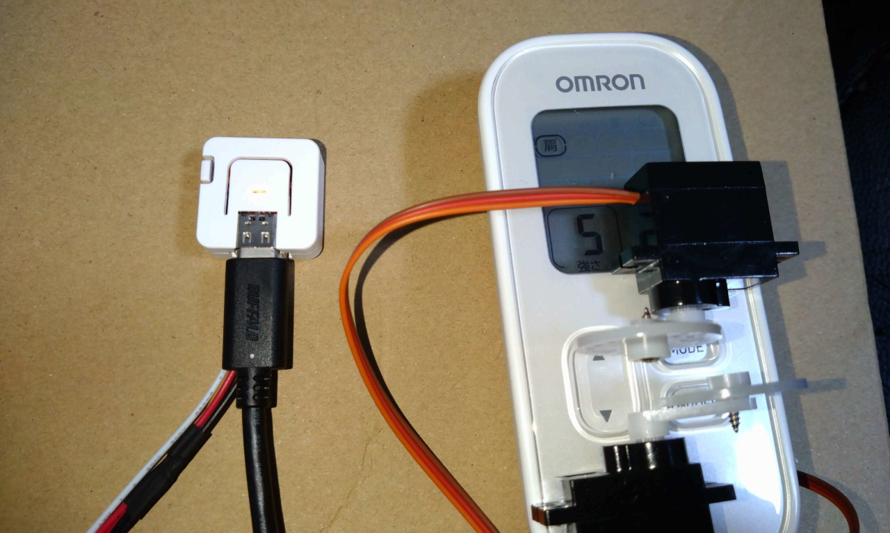

朝陽にいなさんからの依頼で、「コメント連動型電流マシン」のシステム提供を行いました。

### まだ誰もやってない麻雀企画をやりたい

朝陽にいなさんから「麻雀の勉強企画と罰ゲーム電流企画を組み合わせた、まだ誰もやったことがない麻雀企画をやりたい」というアイデアを聞いて、M5Stackやわんコメを使った「コメント連動型電流マシン」の仕組みを思いつきました。

まず、麻雀の勉強配信中によくない牌を切ると、先生役のユーザーが「ダメです」や「違います」というキーワードをコメントします。

すると、わんコメのテンプレート内のプログラムがそれを受け取り、USB接続されたデバイスに強さ・時間をシリアル通信で送ります。

デバイスは送られてきた強さ・時間をもとに、サーボモーターを回して低周波治療器の物理ボタンを押します。

こちらはUSB接続にしたことで、充電の手間や、Wifi・Bluetoothの設定をしなくてよくなり、使いやすくなる工夫をしています。

また、画面上では電流が流れ出すと同時に、配信画面のウィジェットが変化します。

こちらは電流が流れているときにイラストを小刻みに震わせるアニメーションをさせることで、電流が流れていることを視覚的に伝える工夫をしています。

### 調べたら4万円ぐらいであるけど・・・

実は作っている最中に「Pavlok」という4万円ぐらいで買える電気ショックデバイスを見つけました。
しかし、数回の企画のために4万円はなかなか厳しいです。
そのうえ、専用のスマホアプリが必要だったり、YouTubeとの連携に外部サイトへの登録が必要だったり、プログラマー以外の人が使おうと思うとかなり大変でした。

今回作成した「コメント連動型電流マシン」では、VTuberが配信でよく使う低周波治療器やわんコメを使うようにしたことで、かかる費用をほぼデバイス代のみの3000円程度にまで抑えることができました。
また、よく使うソフトを使ったことでインストールや配信準備の手間を少なくすることができました。

### リンク

- [実際に使われた配信 YouTube](https://www.youtube.com/watch?v=SBd20R84Pjk)
- [朝陽にいなさん Xアカウント](https://twitter.com/asahinina)
- [プログラムのソースコード GitHub](https://github.com/yuarasino/biribiri4keyword)
