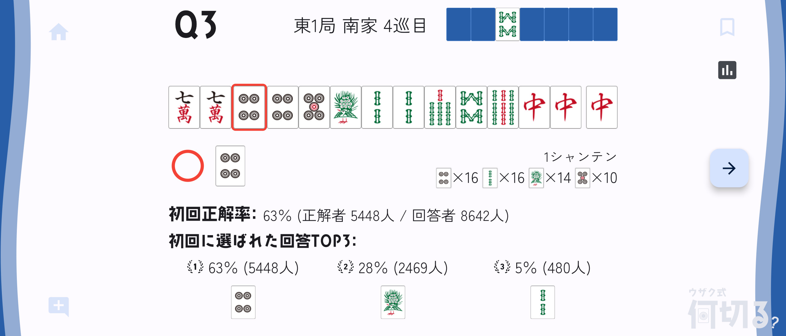

何切る本著者のＧ・ウザクさんと、アプリ開発者の椎凰いとさんからの依頼で、「ウザク式何切るアプリ」の開発サポートを行いました。

### みんなが何を選んだのかを知りたい！！

何切る本にはない機能として、他のみんなが何を選んだかを見れる何切る統計機能があります。

みんなが一択になっている問題は間違えたらいけない大事な問題と分かったり、逆に差がつかない問題は難しい問題が分かるようになったモチベーションにつながったりするので、あったらとても嬉しい機能です。  
開発者にとっても、問題の改善をしたり今後の出題傾向を考えたりするうえで、とても参考になります。

何切る統計機能の実装にあたっては、取りたい項目の洗い出しを行い、NoSQLのデータベースに合わせて統計モデルの実装を行いました。  
何切るの画面では、限られたスペースで最大限に見やすくなるようレイアウトを調整しました。

### Flutterやったことないんですけど・・・

実はFlutterの開発経験は全くなかったのですが、麻雀界隈に何か貢献したいと思い、開発者の椎凰いとさんにDMしてみたのが開発に携わるきっかけでした。

最初は細かい不具合の修正を通してプログラムを把握しながらFlutterに慣れ、最後には大きな機能1つを任せてもらえるようになりました。

Reactなどのフロントエンドの経験やFirebaseを使ったアプリの開発経験が活きて、短期間の勉強でがっつり開発に参加できたのがよかったです。

### リンク

- [ウザク式何切るアプリ 公式サイト](https://nanikiru.uzakushiki.com/)
- [Ｇ・ウザクさん Xアカウント](https://twitter.com/mjbook)
- [椎凰いとさん Xアカウント](https://twitter.com/ito_shiio)
